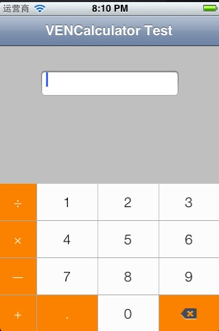

VENCalculatorInputViewTest
===========
[VENCalculatorInputView](https://github.com/venmo/VENCalculatorInputView) Use Demo.
在 [VENCalculatorInputView](https://github.com/venmo/VENCalculatorInputView)基础上写了个使用用例。还有几点改善，界面适配，界面外点击退出，操作符末端替换，小数正则优化，负小数正常操作，使用优化。
   
  

What you need
---

* [VENCalculatorInputTextField.h](https://github.com/Ericfengshi/VENCalculatorInputViewTest/blob/master/VENCalculatorInputTextField.h)
* [VENCalculatorInputTextField.m](https://github.com/Ericfengshi/VENCalculatorInputViewTest/blob/master/VENCalculatorInputTextField.m)
* [VENCalculatorInputView.h](https://github.com/Ericfengshi/VENCalculatorInputViewTest/blob/master/VENCalculatorInputView.h)
* [VENCalculatorInputView.m](https://github.com/Ericfengshi/VENCalculatorInputViewTest/blob/master/VENCalculatorInputView.m)
* [VENCalculatorInputView.xib](https://github.com/Ericfengshi/VENCalculatorInputViewTest/blob/master/VENCalculatorInputView.xib)
* VENCalculatorInputView.bundle

How to use
---  
详细请见[ViewController.h](https://github.com/Ericfengshi/VENCalculatorInputViewTest/blob/master/VENCalculatorInputViewTest/ViewController.m)

```objective-c
VENCalculatorInputTextField *venTextField = [[[VENCalculatorInputTextField alloc] initWithFrame:frame] autorelease];
```


